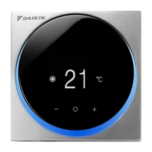
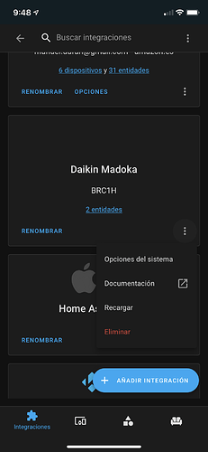
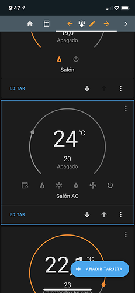
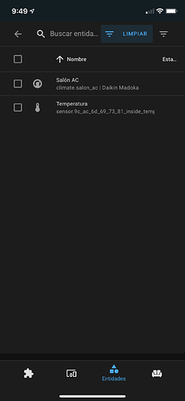

# Home Assistant Daikin Madoka

This is a custom component developed to support Daikin Madoka BRC1H thermostats in Home Assistant. 

    

## Installation

Download folder and copy under "custom_components" folder in the Home Assistant configuration folder.

## Requirements

Due to the thermostat security constraints, is has to be manually paired with the system where HomeAssistant runs. This has only been tested in Linux, but the following steps should be easy to follow:

1. Disconnect the thermostat from any other device (thermostat Bluetooth menu, forget). This has to be done to make the device visible during the scanning.
2. On a terminal, run "bluetoothctl"
3. Type "agent KeyboardDisplay"
4. Type "remove <BRC1H_MAC_ADDRESS>". This step helps to remove unsucessful previous pairings and makes the device visible.
5. Type "scan on" and wait until the mac is listed.
6. Type "scan off"
7. Type "pair <BRC1H_MAC_ADDRESS>". You will be presented a confirmation prompt, accept it.
8. Go to the thermostat and accept the pairing code. It requires to do it fairly soon after the previous step or it will be cancelled.
9. The device is ready and you can start the integration in Home Assistant.

A dedicated Bluetooth adapter is desirable. If you run Home Assistant in a virtual machine, it makes it easiser for the device to be used. In VMWare, make sure to remove the checkbox "Share bluetooth devices with guests". This way, the adapter will become visible to the virtual machine and will use it without problem. 

## Usage

A new integration will be available under the name "Daikin Madoka". You have to provide the following details:

- Bluetooth MAC Address of the BRC1H device(s)
- Name of the Bluetooth adapter (usually hci0)

The integration will scan for the devices and will create the thermostat and the temperature sensor.

## TODO
This document.
Icon and integration images.
